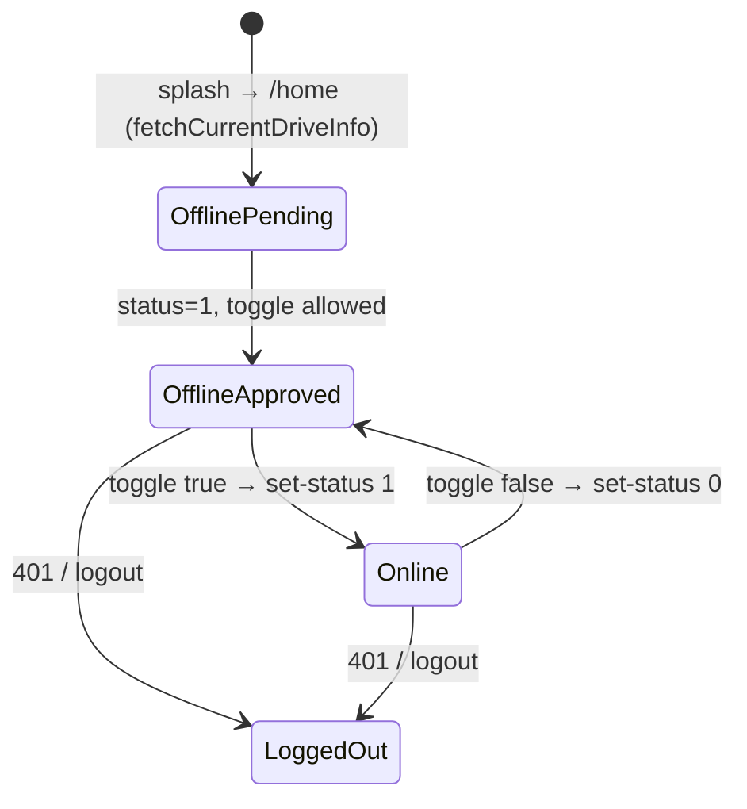
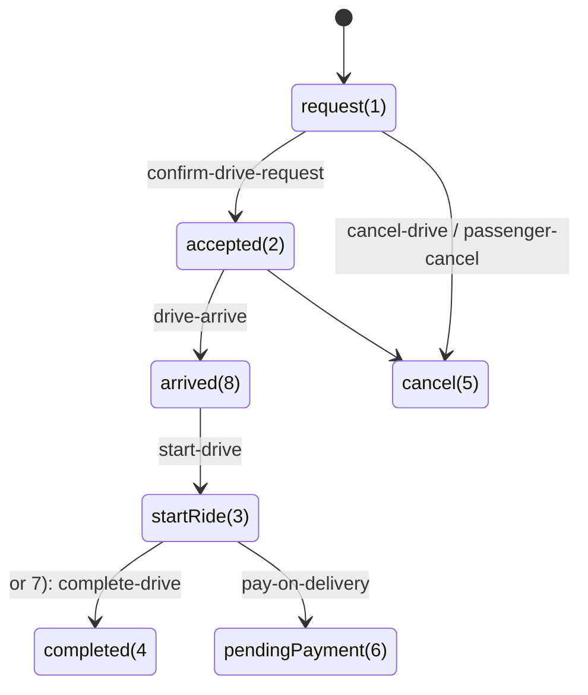
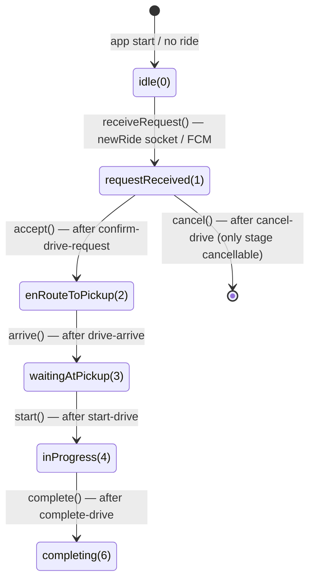

# 03 — Driver and Ride Domain Model

**Scope:** the entities and state machines the driver app models — the driver, their vehicle, the booking/ride, driver availability and approval, the *server booking-status integer*, and the full ride lifecycle end to end (request → payment).

**Status:** READ-ONLY. Claims carry `CONFIRMED` / `INFERRED` / `UNCLEAR — NEEDS CONFIRMATION` + `file:line`.

---

## 1. Domain glossary (repo terminology)

Every term below is used verbatim in the codebase; names in (parens) are the Dart identifiers.

| Term | Meaning | Evidence |
|---|---|---|
| **Driver** (`Driver`) | User of this app: `id, name, phone, dob, gender, status (approval), profileImage, card/licence fields, lastLocation` | `data/models/register_model.dart:45-132`, `data/models/current_driver_info_model.dart:120-213` |
| **Vehicle** (`Vehicle` → `typeVehicleId`) | The driver's registered vehicle; `typeVehicleId` picks the marker/vehicle-type; `pricrVehicle` is the per-km price, `minimumFare` the fare floor | `data/models/vehical_model.dart:35-79`, `booking/view.dart:394-405` |
| **Vehicle type** (`SingleVehical`) | Catalog from `get-vehical`: `id, name, price, minimumFare, image`; types 1–5 (Rickshaw, Classic Car, Mini Van, SUV, Alphard VIP) | `data/models/vehical_model.dart`, `app/funtion_convert.dart:97-107` |
| **Booking / Request** (`BookingScreenArgs`) | What drives one trip screen instance: `bookingId, bookingCode, passengerId, latPassenger/lngPassenger, desLatPassenger/desLngPassenger, typeVehicleId, pricrVehicle, timeOut, processStepBook, startTime, latStart/lngStart, latDriver/lngDriver, refreshApp` + passenger contact/profile | `routes/route_arguments.dart:70-114` |
| **Ride / trip status** (`BookingStatus`) | Server-side integer: `request=1, accepted=2, startRide=3, completed=4, cancel=5, pendingPayment=6, completedAlt=7, arrived=8` | `core/contracts/booking_status.dart:12-27` |
| **Passenger** (`Passenger`) | The counterparty: `id, name, phone, profileImage, roleId, lastLocation` | `data/models/current_driver_info_model.dart:215-312` |
| **Payment** (`Payment`) | Invoice summary: `invoiceId, rideId, distance, duration, amount, paymentMethod, status/statusName` | `data/models/current_driver_info_model.dart:424-478` |
| **TripStage** (`TripStage`) | Driver-side lifecycle stage (walking-graph `processStepBook`): `idle=0, requestReceived=1, enRouteToPickup=2, waitingAtPickup=3, inProgress=4, completing=6` (5 unused) | `features/trip/domain/trip_state_machine.dart:21-49` |
| **Driver status / approval** (`DriverApprovalStatus`) | `driver.status`: `0=pending, 1=approved, 2=rejected`, `unknown` default | `app/state.dart:4-23` |
| **Availability** (`isDriverActive` / `isOnline`) | `check-status`/`set-status` `is_available == 1`; approval-gated toggle | `set_status_model.dart:26-35`; `app/logic.dart:61-75` |
| **Wallet** (`WalletModel`) | `balance, debted, commistionFare, currency, transactions[]` | `features/wallet/data/models/wallet_model.dart:38-90` |
| **History** (`DataHistory`) | Past bookings incl. `payment` per trip | `features/history/data/models/history_driver_info_model.dart:52-137` |
| **Earnings** (`TripEarnings` / `EarningsPeriod`) | *Planned* domain: `today/thisWeek/thisMonth/allTime`, fare basis full/net-of-commission — **no backend yet** | `features/earnings/domain/earnings.dart` |
| **Referral rewards** (`RewardStatus`, `ReferralDashboard`) | *Planned* domain: reward lifecycle + dashboard — **no backend yet** | `features/referral/domain/*.dart` |

Notes on modelling style (**CONFIRMED** via the model files): JSON models are hand-written; nearly every field is nullable/`dynamic` for resilience; `fromJson` uses typed helpers (`json_field.dart`, `json_list.dart`); money (per-km price, minimum fare) fails loudly via `requireMoneyInt` while display fields degrade (`vehical_model.dart:55-68`).

---

## 2. Driver states

### 2.1 Availability + approval (app-lifetime)

Mermaid state diagram for the app-level `AppLogic` state (`app/state.dart`, `app/logic.dart`):

Evidence:
- `canAccept`-style gating is not part of approval; instead the online **toggle** refuses while unapproved (`app/logic.dart:62`), and the UI hides the toggle behind a "waiting approval" overlay for unapproved drivers (`drawer/view.dart:344-379`).
- Resume routing on `currentDriveInfo` (`home/logic.dart:204-210`): `pendingPayment` → `/calculate-fee`; any other non-null status → `/booking` with a computed `processStepBook` (`home/logic.dart:268-277`).

### 2.2 Server booking-status integer

`core/contracts/booking_status.dart` (**CONFIRMED**, client-owner supplied, marked Q-1/open with backend):

Why both `4` and `7` are "completed" is unresolved — the owner supplied both with no explanation; kept as separate constants on purpose (`booking_status.dart:19-24`). This mapping is **not** backend-confirmed (**UNCLEAR**), and replaces the old dead/wrong `core/utils/status_util.dart` mapping (`booking_status.dart:5-8`).

---

## 3. Driver-side ride lifecycle (`TripStateMachine`)

Pure Dart state machine with guarded transitions — every method either advances or throws `InvalidTripTransition` (**CONFIRMED**, `features/trip/domain/trip_state_machine.dart:67-123`):

Key rules encoded:
- `canCancel == (stage == requestReceived)` — the UI only offers cancel while a request is pending (`trip_state_machine.dart:73`; `ride_request_bottom_pop_widget.dart:318-397` shows Cancel only at `processType == 1`).
- There is **no unconditional, timer-driven self-advance** possible — deliberately replacing the legacy widget's `Future.delayed(... processStepBook = N)` timers (`trip_state_machine.dart:8-14`).
- Stage ↔ legacy `processStepBook` int interop extension (`trip_state_machine.dart:30-49`); used by route args and `home/logic.dart` resume.

### 3.1 Lifecycle ↔ REST ↔ socket map

| Stage transition | REST (success gates it) | Socket emit afterwards | Notify |
|---|---|---|---|
| request → accepted | `POST /taxi-driver/confirm-drive-request` `{ride_id}` | `acceptRide {driver_id, booking_id, passengerId, location, destination}` | local "ACCEPT" |
| request → cancelled | `POST /taxi-driver/cancel-drive` `{ride_id}` | `driverCancelDrive {booking_code, booking_id, passengerId}` (in widget) | — |
| enroute → arrived | `POST /taxi-driver/drive-arrive` `{ride_id}` | `rideArrival {booking_code, passengerId, location}` | local "ARRIVE" |
| arrived → started | `POST /taxi-driver/start-drive` `{ride_id}` | `startDrive {booking_code, booking_id, passengerId, location}` | local "START_RIDE" |
| started → completed | `POST /taxi-driver/complete-drive` (ride, end coords/address, distance) | `dropDrive {...}` | local "COMPLETE_RIDE" |
| completed → paid | `POST /taxi-driver/accept-payment` `{ride_id}` | `acceptPayment {passengerId, booking_code, booking_id}` | navigates home |

Evidence:
- REST: `features/trip/data/datasource/trip_datasource.dart:17-92`; payment: `features/payment/data/datasource/payment_datasource.dart:10-17`.
- Controller wiring (only advance on `ok`; distinct accept-failure modes `rideAlreadyAccepted`/`confirmFailed`/`generic`): `presentation/screens/booking/logic.dart:33-156`.
- Socket emits fired from the view after each successful transition: `booking/view.dart:407-466` (`_onTripAction`).
- The button bar per stage: `ride_request_bottom_pop_widget.dart` — Cancel+Accept at request, Accept→Arrive→Start-Ride→Drop (`booking/view.dart:706-716`). Drop calls `getLocation(TripStage.completing)` which reverse-geocodes the drop point then calls `tripController.complete(...)` (`view.dart:267-284`).

### 3.2 Fare/distance handling during the trip

- `_startLocationListener` accumulates distance while `inProgress` only when there is **no** destination, then `totalFee = estimateFare(...)` (`booking/view.dart:147-171`).
- With a destination, `totalDistance/totalFee` are computed once from the Directions route (`view.dart:340-358`).
- `estimateFare(distanceKm, pricePerKm, minimumFare)` = `minimumFare` if ≤1 km else `minimumFare + (distanceKm−1)·pricePerKm` (`core/utils/fare_estimate.dart:14-15`). **Display-only** — the server recomputes at `complete-drive`; the calculate-fee screen shows the server's `payment.amount`, not the estimate (`calculate_fee/view.dart:71-72`, `fare_estimate.dart`).
- Distance accumulation is a float-sum in the UI, not a server-authoritative odometer (**INFERRED** side effect of `view.dart:147-171`).

---

## 4. Ride-request entry points

A driver gets a ride request via two channels (**CONFIRMED**):

1. **Socket** `newRide` event with nested `passenger/location/destination` maps — `services/socket_service.dart:150-169` → `parseNewRideArgs` → `BookingScreenArgs(processStepBook:1)` → `Get.toNamed('/booking')`.
2. **FCM push** with `notification_type == 'service_booking'` and the same fields JSON-encoded as strings — `services/notification_logic.dart:209-224` → same parser.

The parser `features/trip/data/new_ride_payload_parser.dart:34-61` accepts both shapes; `booking_id/booking_code/passengerId` are required, everything else degrades to safe defaults (D-05 — a malformed payload used to silently drop the whole request, `:5-24`).

Resume path: `get-current-drive-info` returns the active ride; home routes into `/booking` with `processStepBook` mapped from the status int (`8→3, 3→4, default→2`) (`home/logic.dart:265-277`) — note the documented quirk M-21 that out-of-range statuses (incl. `cancel`/`completed`) also fall through to `enRouteToPickup` (`home/logic.dart:266-267`).

---

## 5. Cancellation paths

- **Driver cancels** (request stage only): confirm dialog → `DriverSocketService().driverCancelDrive(...)` + `tripController.cancel()` (REST) (`ride_request_bottom_pop_widget.dart:349-368`).
- **Passenger cancels**: server emits `onPassengerCancelDrive` → `AlertWidget().cancelBooking(context)` shows a 10s auto-dismiss dialog and returns to home (`socket_service.dart:172-184`; `app/alert_widget.dart:33-49`; `presentation/widgets/cancel_book_dialog_widget.dart`).
- On `TripCancelled()` result the view does `Get.offAllNamed('/home')` (`booking/view.dart:463-464`).

---

## 6. Post-ride → payment

`CalculateFeeScreen` (`calculate_fee/view.dart`, `logic.dart`, `state.dart`) — **CONFIRMED**:

- Rendered after both a completed drop-off (`routFrom:"FromDropBooking"` with `CompleteDriverModel`) and a home resume (`routFrom:"FromHome"` with `DataDriverInfo`) (`logic.dart:44-60`).
- Shows passenger, "PAYMENT_COLLECTION" payment method, server distance/duration/amount, addresses, red "TOTAL_PRICE" bar (`view.dart:164-393`).
- `PAYMENT_DONE` → `accept-payment` REST; on success → `acceptPayment` socket event → refetch profile → `/home` (`logic.dart:84-91`, `logic.dart:68-77`). Error path → generic dialog (`logic.dart:78-81`).

---

## 7. Confidence summary

- **CONFIRMED:** glossary entities + their JSON fields, approval mapping, availability toggle+gating, booking-status constants as supplied, `TripStateMachine` transitions and cancellation-only-from-request rule, full REST+socket wiring per transition, both ride-request entry points, resume routing incl. its documented quirk, display-vs-server fare split, payment flow.
- **INFERRED:** the server-side status graph in §2.2 (drawn from the client constants + call sites, not a server contract); accepted(2)→arrived(8)→startRide(3) linearity.
- **UNCLEAR — NEEDS CONFIRMATION:** status `7` duplicate semantics; whether the server ever sends `pendingPayment(6)` vs completing directly; `%Fare` n/a; whether trip distance accumulation during no-destination rides is authoritative enough for fare display (client-side float sum).