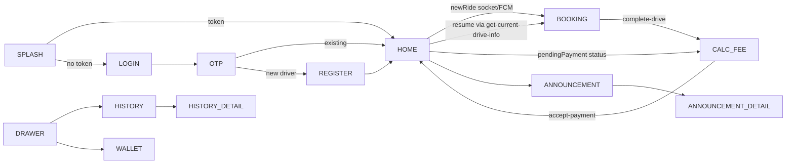

# 06 — Screen and UI Inventory

**Scope:** every screen and route in the driver app, its content, its data dependencies, and the flows between them. Evidence is `file:line` into `pu_driver/lib/presentation/` unless noted.

**Status:** READ-ONLY. Claims carry `CONFIRMED` / `INFERRED` / `UNCLEAR — NEEDS CONFIRMATION`.

---

## 1. Route table

`routes/app_routes.dart:5-18` and `routes/app_pages.dart:37-104` (**CONFIRMED**):

| Route | Page | Binding | Notes |
|---|---|---|---|
| `/splash` | `SplashPage` | `SplashBinding` | session check → `/home` or `/login` |
| `/login` | `LoginPage` | `LoginBinding` | phone submit |
| `/otp` | `OtpPage` | `OtpBinding` | 4-digit Pinput, resend |
| `/register` | `RegisterPage` | `RegisterBinding` | new-driver onboarding |
| `/home` | `DrawerScreen` | 8 bindings (`DrawerBinding, ProfileBinding, HomeBinding, AnnouncementBinding, ContactUsBinding, HistoryBinding, TermConditionBinding, WalletBinding`) — noTransition | shell hosting the six tabs |
| `/notification` | `AnnouncementPage` | `AnnouncementBinding` | paginated announcements |
| `/notification-detail` | `AnnouncementDetailPage` | `AnnouncementDetailBinding` | `/notification` item detail |
| `/map-history-detail` | `HistoryDetailPage` | `HistoryDetailBinding` | completed-trip map replay |
| `/calculate-fee` | `CalculateFeeScreen` | `CalculateFeeBinding` | post-ride + resumed payment |
| `/booking` | `BookingScreen` | `BookingBinding` | the trip screen |

Screens shown *inside* `DrawerScreen` have no routes: history, wallet, term-condition, contact-us, announcement (CHANNEL, commented out), profile header (`app_routes.dart:2-4`).

---

## 2. Screen-by-screen inventory

### 2.1 Splash (`splash_screen/`)
3s branded splash; location permission; routes by session (doc 02 §3).

### 2.2 Login (`login/`) → OTP (`otp/`) → Register (`register/`)
Described in doc 02 §5–7: phone + `+855` formatting (`login/view.dart:143-199`), 4-digit OTP with countdown (`otp/view.dart:81-83`, `otp/logic.dart:47-67`), full onboarding form with four photo uploads (`register/view.dart:119-398`).

### 2.3 Drawer shell (`drawer/`)
The app's `bottom-nav` equivalent (**CONFIRMED**, `drawer/state.dart:5`, `drawer/view.dart`):

- Tabs enum: `home, history, wallet, termCondition, contactUs, announcement` (`drawer/state.dart:5`); labels `TAARRAA/RIDING_HISTORY/MY_WALLET/TERMCONDITION/CONTACTUS/CHANNEL` (`drawer/view.dart:32-43`).
- AppBar online/offline `SwitchOnlineWidget` visible on the home tab only (`drawer/view.dart:94-98`).
- Connectivity red banner (`NO_INTERNET_CONNECTION`) driven by `internet_connection_checker_plus` (`drawer/logic.dart:26-28`, `drawer/view.dart:321-343`).
- Unapproved-driver overlay (`WAITING_APPROVED_FROM_ADMIN`) covering the lower screen (`drawer/view.dart:344-379`).
- Language switcher bottom sheet (`drawer/view.dart:220-249`, `widgets/widget_change_laguage.dart`).
- Logout UI commented out (`drawer/view.dart:252-298`).

### 2.4 Home tab (`home/`)
Full-screen live `GoogleMap` with the driver's tuk-tuk marker, force-update overlay (`WidgetUpdate`) when `version_check` says an update is pending (`home/view.dart:46-58`), map driven by `HomeLogic` (`home/logic.dart`). Ride-resume routing on `currentDriveInfo` (doc 03 §4). `SwitchOnlineWidget` overlaid in the drawer appbar.

### 2.5 Booking trip screen (`booking/`)
Yes/this is the most complex screen (`booking/view.dart`):
- AppBar title reflects stage: `NEW_RIDE_REQUEST / GO_TO_PASSENGER / PREPAIR_TO_GO / CARRYING_PASSENGER` (`view.dart:611-620`).
- GoogleMap + markers + polylines (doc 05 §2–4); `PopScope(canPop:false)`.
- `SmoothCircularCountdown` overlaid while a request is pending (`view.dart:681-691`, `widgets/count_down_widget.dart`; auto-navigates home on expiry).
- `ModelBottomSheetNewRequestWidget` (bottom sheet, expandable): passenger photo/name/phone (with `tel:` call button), current/whence/destination labels, distance + riel price, per-stage CTA button and Cancel (doc 03 §3.1; `booking/widgets/ride_request_bottom_pop_widget.dart`).
- `ShowDistandWidget` (in-trip "DURATION/DISTANCE/TOTAL_PRICE" strip) while `inProgress` (`view.dart:661-680`; `widgets/show_distand_and_price_widget.dart`).
- `LoadingWidget` overlay during API actions (`view.dart:718`).
- Error dialogs via `showErrorCustomDialog` for accept-conflict and generic failures (`view.dart:468-482`).

### 2.6 Calculate-fee / payment (`calculate_fee/`)
Post-ride summary + `PAYMENT_DONE` (doc 03 §6): passenger, payment-method "PAYMENT_COLLECTION", server distance/duration/amount, trip timestamp, start/end addresses, red total-price bar (`view.dart:164-393`).

### 2.7 History (`history/`) + History detail (`history_detail/`)
- Tabs `COMPLETED` (status 4) / `CANCELLED` (status 5) (`history/view.dart:58-71`, `history/state.dart:14`), infinite scroll (`view.dart:34-39`), pull-to-refresh (`view.dart:86`).
- Cards: passenger image/name, invoice ID, payment method, distance/duration/amount, date, map thumbnail, addresses (`history/widgets/history_card_widget.dart`).
- API `GET /taxi-driver/history-drive-info?page=&status=` (`features/history/data/datasource/history_datasource.dart:15-18`).
- Tap → `/map-history-detail` with `MapHistoryDetailArgs{typeVehicleId, cost, distand, duration, latStart, lngStart, latEnd, lngEnd}` (`route_arguments.dart:32-52`, `history_card_widget.dart:204-214`) → map replay + `ShowDistandWidget` (`history_detail/view.dart:44-73`).

### 2.8 Wallet (`wallet/`)
Two balance cards — `COMMISSION_FARE` and `WALLET` — plus transaction list with type-filter chips (`wallet/view.dart:76-96, 188-228`). API `GET /taxi-driver/wallet` (`features/wallet/data/datasource/wallet_datasource.dart:12-13`). Formatting helpers in `features/wallet/wallet_presentation.dart`.

### 2.9 Profile (header inside drawer)
`ProfileHeaderWidget` (`profile/widgets/profile_header_widget.dart:42-85`): avatar, name, phone, vehicle type + driver id; API `getProfile()` (`profile/logic.dart:22`). **No rating displayed.**

### 2.10 Announcements (`announcement/`, `announcement_detail/`)
Paginated list (unread highlight `status==0`), detail with images (`announcement/view.dart:80-138`, `announcement_detail/view.dart`); args `NotificationDetailArgs{notificationId, appOpened}` (`route_arguments.dart:22-30`).

### 2.11 Term condition / Contact us
Static numbered terms (`term_condition/view.dart:22-43`); company contact card w/ `tel:`/`mailto:` (`contact_us/view.dart:24-67`).

---

## 3. Cross-cutting UI behaviour

- **Bottom sheets / dialogs** reused across screens: `presentation/widgets/` — `FBTNWidget`, `SmoothCircularCountdown`, `showCancelBookingDialog` (10s auto-dismiss), `showPocessBookingLoadingDialog`, `showErrorCustomDialog`, `showYesNoCustomDialog`, `ShakeWidget`, `LoadingWidget`, `Shimmer*`, `ChangeLanguage`, `XTextField`, `SearchableDropdown`, `CardUploadAttachment`, `TImageWidget`, `WidgetUpdate` (forces update), `DecoratedInputBorder`.
- **EasyLoading** overlay used by `AppLogic.toggle` (`app/logic.dart:65-74`) and global spinner config (`main.dart:60-74`).
- **Keyboard dismisser** wraps the whole app (`root_main.dart:17-18`).

---

## 4. Flows

---

## 5. Confidence summary

- **CONFIRMED:** full route table + bindings, drawer tab set/labels, home map + update overlay, the entire booking-screen stage UI, calculate-fee layout, history/wallet screens and their endpoints, profile header, announcement pages, the `MapHistoryDetailArgs` shape.
- **INFERRED:** screen "completeness" ordering (which tabs were migrated before others) from comment references in `app_pages.dart:58-61`.
- **UNCLEAR — NEEDS CONFIRMATION:** why `CHANNEL` (announcement) is commented out as a drawer tab while the feature + route exist (`drawer/view.dart:202-218`); whether the wallet "commission fare" card is meant to show a platform commission balance; whether history "CANCELLED" also should include passenger-cancelled rides (client filters only by `status`, `history/state.dart:14`).