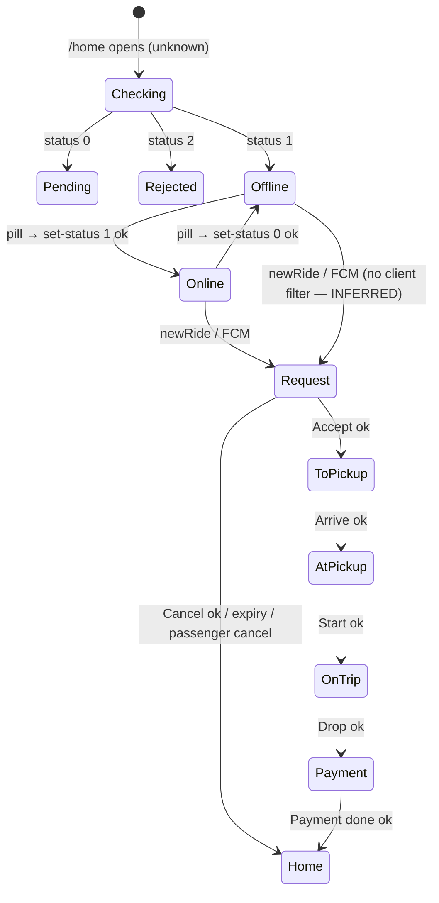

# 05 — Interaction and States

This doc covers **how each state looks and behaves on screen.** The *trigger* and *outcome* columns describe today's behaviour (CONFIRMED unless marked) and must not change. Paths are relative to `lib/`.

---

## 1. Driver states (only the ones the app actually has)

| Driver state | Source of truth | Visual treatment |
|---|---|---|
| Signed out | No token (`splash_screen/logic.dart:55-57`); a 401 → `SessionService.handleUnauthorized` | Login screen |
| Account check pending | `AppState.approvalStatus == unknown`, the default before `fetchCurrentDriveInfo` resolves (`app/state.dart`) | `ApprovalGate` "Checking your account…" + Retry |
| Pending approval | `driver.status == 0` | `ApprovalGate` amber |
| Rejected | `driver.status == 2` | `ApprovalGate` danger |
| Offline (approved) | `AppState.isOnline == false` | Grey pill; status card "You're offline" |
| Toggling | Inside `AppLogic.toggle` (optimistic value already set, EasyLoading shown) | Pill shows the new value + a busy spinner; if the request fails, the rollback flips it back |
| Online / available | `isOnline == true` | Green pulsing pill; status card "Receiving requests" |
| Ride request | `TripStage.requestReceived` on `/booking` | Request header, countdown, Accept |
| Accepted → going to pickup | `enRouteToPickup`. **"Accepted" isn't a separate state** — accepting moves straight here (`trip_state_machine.dart:82-85`) | Blue header "Go to passenger" |
| Arrived | `waitingAtPickup` | Blue header "At pickup" |
| Passenger on board / trip in progress | `inProgress`. The app doesn't separate "on board" from "in progress": `start-drive` is the boarding moment | Green header "On trip", meter |
| Trip completed, awaiting payment | `completing` → `/calculate-fee`; on resume, server status `6` `pendingPayment` (`home/logic.dart:205`) | Payment screen |
| Paid | `acceptPayment` → `offAllNamed(home)` | Back to Home in the current online state |

**Not in the app, so not designed:** "busy / on trip" availability, breaks, post-trip rating, earnings summary.

INFERRED: the app never changes `isOnline` itself during a trip; the server might.

The client doesn't stop a request from opening while the driver is offline: the `newRide` listener has no `isOnline` check (`services/socket_service.dart:150-169`). INFERRED: the server only sends requests to available drivers.

---

## 2. Ride-request lifecycle

| Moment | Trigger (source) | Screen | Visual | Allowed actions | Preserve |
|---|---|---|---|---|---|
| Request received | Socket `newRide` → `Get.toNamed('/booking')` (`socket_service.dart:156`) or an FCM tap | `/booking`, request stage | Request header, countdown, sheet with passenger and pickup; notification sound from `Taxi.shared.notifyBooking(isSound:true)` | Accept, Cancel, Call | The sound fires even if parsing fails |
| Countdown running | `SmoothCircularCountdown(countDuration: args.timeOut)` (`booking/view.dart:681-691`) | same | Ring drains; at ≤10 s the arc and number turn `warning` (visual only) | Accept, Cancel | The duration comes from the payload |
| Accepting | `accept()`, `isLoading = true` | same | Accept spinner; Cancel disabled; the countdown keeps running | Call | Guard (`booking/logic.dart:34`) |
| Accepted | `TripAccepted` → `acceptRide` emit, polyline (`view.dart:411-423`) | same, pickup stage | 150 ms stage cross-fade; timeline step 1 done; the countdown widget is removed | I've arrived | Emit order |
| Already accepted by someone else | `model.message == 'RIDE_ALREADY_ACCEPTED'` (`logic.dart:50`) | dialog | `TDialog.error`: "Ride already accepted" / "Booking has already been accepted by another driver." | OK | OK pops the dialog **and** `/booking` (DD-33) |
| Confirm failed | 200 with no `data` | dialog | `TDialog.error` `COMFIRM_ERROR` | OK | same |
| Network / HTTP error | `Result.err` | dialog | `TDialog.error` `PLEASE_TRY_AGAIN*` | OK | same |
| Declining (driver cancel) | Cancel → confirm → `onYes`: `driverCancelDrive` emit, **then** `cancel()` (`ride_request_bottom_pop_widget.dart:349-368`) | dialog → same | `TDialog.confirm` "Cancel request?" with `[Yes, cancel]` (destructiveOutline) and `[Stay]` (primary). Then the Cancel spinner, and Accept disabled | — | Emit order, and the emit happens even if REST fails |
| Declined | `TripCancelled` → `Get.offAllNamed('/home')` (`view.dart:463-464`) | Home | No extra feedback (today's behaviour) | — | — |
| Expired | Countdown dismissed → `Get.offAllNamed('/home')` (`count_down_widget.dart:32-37`) | Home | Optional P3: "Request expired" toast on Home (DD-16) | — | Navigation unchanged |
| Passenger cancelled | `onPassengerCancelDrive` → `AlertWidget.cancelBooking` | dialog | `TDialog.autoDismiss` with a 10 s bar | OK → home | Double navigation; global listener (DD-25) |
| Duplicate request while on `/booking` | `Get.toNamed` with `preventDuplicates` (GetX default, INFERRED) | unchanged | None; the sound still plays | — | — |
| Stale request (a late FCM tap) | Parser → `/booking` with a fresh countdown | request stage | Normal; an accept attempt yields "already accepted" or "confirm failed" | — | — |

**Known races — documented, not changed:**
- **Expiry during an in-flight accept.** The countdown can expire while `accept()` is in flight; the navigation to home happens anyway. INFERRED: it recovers the next time `DrawerLogic` is created and `fetchCurrentDriveInfo` runs.
- **The countdown starts at mount, not at the server timestamp.**

---

## 3. Trip stages after acceptance

| Stage | Entry | Header / pill | Sheet focus | Primary | Loading visual | Exit |
|---|---|---|---|---|---|---|
| Going to pickup | `TripAccepted`, or resume with status `2` / other (M-21) | "Go to passenger", `stage.pickup` | Pickup address (`title`), passenger | I've arrived | Button spinner | `TripArrived` → `rideArrival` emit |
| Arrived | `TripArrived`, or resume with status `8` | "At pickup", `stage.pickup` | Passenger, destination + distance, "≈ Est. fare" when computed | Start ride (success) | Button spinner | `TripStarted` → `startDrive` emit, timer starts |
| Trip started / in progress | `TripStarted`, or resume with status `3` (timer from `args.startTime`) | "On trip", `stage.onTrip` | Meter (always visible), destination | Drop off | Spinner **from the tap**: a view-local flag covers geocoding before `complete()` sets `isLoading` | `TripCompleted` → `dropDrive` emit → `/calculate-fee` |
| Completed | `/calculate-fee` (`FromDropBooking` or `FromHome`) | "Collect payment" app bar | Total to collect | Payment done (success) | Button spinner (`PaymentStatus.loading`) | Success → `acceptPayment` emit → refetch profile → home |

**Resume** (`home/logic.dart:224-263`):
- `TDialog.progress` "Resuming your trip…" for 2 s, then `Get.offNamed('/booking')` at the mapped stage.
- Quirk M-21: statuses `cancel` and `completed` map to "Go to passenger". Preserved and flagged — R4 in `docs/reverse-engineering/08`.

---

## 4. Loading / empty / error by screen

| Screen | Loading | Empty | Error | Offline |
|---|---|---|---|---|
| Splash | Logo only | — | Falls through to login (exception-safe) | — |
| Login / OTP / Register | Button spinner, inputs disabled | — | Existing error dialog (restyled); inline field errors | REST error dialog |
| Shell profile head | Skeleton (`ShimmerProfile`) | — | Error text on the header (`profile_header_widget.dart`) | — |
| Home | `LocationStateView` loading | — | Permission denied or failure view + Open settings | Banner |
| Trip | Button spinner + siblings disabled | Address lines as skeleton lines | `TDialog.error` ×3 | No banner (DD-26); REST failures → error dialog |
| Payment | Button spinner | — | `TDialog.error` (single pop, "Try again") | same |
| History | 3 skeleton cards | `TEmptyState` per tab (new) | `TErrorState` + Retry → `reload` | Banner (shell) |
| History detail | Map without a polyline until the route returns | — | Map without a polyline (today's behaviour) | — |
| Wallet | Skeleton cards + rows | `NO_TRANSACTIONS_YET` | `TErrorState` + Retry → `fetch` (the existing retry) | Banner |
| Announcements | Skeleton rows | `TEmptyState` (new) | `TErrorState` + Retry → `reload` | — (it's a pushed route) |

---

## 5. Network and realtime states

- **Internet reachability:**
  - Observed only in the shell (`DrawerLogic` → `DrawerState.connection`).
  - Shown as the amber `OfflineBanner`.
  - Showing it on `/booking`, `/calculate-fee` or other routes needs shared connectivity state (a separate change, DD-26).
- **Socket connection:**
  - Not visible to the UI. `BaseSocketService` only logs connect / disconnect (`services/socket_service.dart:52-63`).
  - Emits made while disconnected are **buffered** and flushed on reconnect (`:85-98`), and retries never stop (`:36-42`).
  - So: no socket indicator. A proposed follow-up exposes a connection stream.
- **Reconnection:** listeners are re-attached on every connect (`:137-147`). Invisible, and correct as is.
- **FCM:**
  - Foreground `service_booking` messages are ignored because the socket handles them. Other types route to the announcement detail.
  - Background and terminated taps route through the same parser (`services/notification_logic.dart:35-63, 200-235`).
  - No UI change beyond the restyled destination screens.
- **Local notifications:**
  - Trip transitions post system notifications (`notifyBooking(isSound:false)` in `booking/logic.dart`).
  - These stay. **No duplicate in-app toast** for the same events (DD-27).
- **Background / foreground:** no lifecycle handling was found for GPS or the socket (INFERRED). No UI.

## 6. Location states

| Where | State | Visual |
|---|---|---|
| Home | `LocationLoadStatus.inProgress` | Map skeleton + "Finding your location…" |
| Home | `permissionDenied` | Icon + explanation + "Open settings" (PROPOSED: same `openAppSettings` as failure) |
| Home | `failure` | Error text + "Open settings" (existing action) |
| Home | `success` | Map + status card |
| Trip | Reverse-geocode pending (`currentPassengerPM == ""` etc.) | Skeleton line in `TAddressRow` |
| Trip | `getLocation` fails | Today: `debugPrint` only, and a thrown `getCurrentPosition` is unhandled (INFERRED). No UI; a robustness fix is a separate change |
| All | GPS accuracy / spoofing | Not modelled; no UI |

## 7. Bottom sheets

- **Trip sheet** (persistent):
  - Expanded by default. Collapsed only when the screen is first built at `inProgress` (existing init rule).
  - The collapse control is the grabber tap or the header chevron.
  - Meter and footer always stay visible.
  - Max height 74%.
  - The map's bottom padding tracks the sheet height.
  - Stage changes cross-fade the content over 150 ms. The timeline step fills over 200 ms.
- **Modal sheets:** only the register photo picker (`xShowModalBottomSheet`). The language sheet is replaced by `LanguageSegment`.

## 8. Dialog catalogue

| Dialog | Trigger | Barrier-dismissible | Actions | Auto | Navigation | Source |
|---|---|---|---|---|---|---|
| Decline confirm | Cancel on the request stage | As today | Yes, cancel / Stay | — | Through `TripCancelled` | `yesno_dialog_widget.dart` |
| Trip error ×3 | `lastError` | Yes | OK | — | **Pops the dialog and the route** | `error_dialog_widget.dart` (`comfirmBook: true`) |
| Passenger cancelled | Socket | No | OK | 10 s → home | `offAllNamed(home)` | `cancel_book_dialog_widget.dart` |
| Resuming trip | Home `ever(currentDriveInfo)` | Yes | — | 2 s → `/booking` (timer in `HomeLogic`) | `offNamed` | `process_book_dialog_widget.dart` |
| Payment error | `PaymentStatus.error` | Yes | Try again (single pop) | — | Stays | `calculate_fee/logic.dart:78-81` |
| Auth errors | Login / OTP / register logic | As today | As today | — | As today | `showErrorCustomDialog` callers |
| Force update | `updateVersion` | No | Update now → store | — | External | `home/view.dart:47-58` |
| Logout | Unreachable (drawer item commented out) | — | — | — | — | `app/alert_widget.dart:15-31` (DD-05) |

## 9. Transitions

- **Route transitions:** the default fade + rise. `/home` uses none.
- **The trip screen replaces its content in place.** Stages don't push routes.
- **Pill state change:** colour cross-fade over 150 ms. The pulse starts when the pill turns online.
- **Banners** slide down over 200 ms. **Toasts** rise over 250 ms. **The countdown arc** drains linearly.
- **Reduced motion:** no pulse, no slide; opacity only.

## 10. Important actions — safety matrix

| Action | Reversible | Impact | Placement | Existing protection | Added (presentation only) |
|---|---|---|---|---|---|
| Go online / offline | Yes | Availability | App-bar pill (home) | Approval gate; rollback on error | Busy state; locked look when unapproved |
| Accept | No | Commits the driver | Pinned primary, 56 | `isLoading` guard | Siblings disabled; ≥16 px from Cancel |
| Cancel request | No | Passenger notified | Tertiary, below Accept | Confirm dialog | "Stay" is the prominent choice; disabled while loading (**required**, DD-17) |
| I've arrived | No | Passenger notified | Pinned primary | Guard | — |
| Start ride | No | Timer and fare start | Pinned success | Guard | — |
| Drop off | No | Fare computed from GPS | Pinned primary | Guard (after geocoding) | Spinner from the tap; confirmation OPEN (DD-13) |
| Payment done | No | Money settled | Pinned success | `loadingBut` | — |
| Call passenger | n/a | External | 48 px icon button | — | Stays enabled while loading |

---

## 11. Behaviour to preserve — master checklist

| # | Behaviour | Source |
|---|---|---|
| 1 | Trip stages advance only after the matching REST call returns `ok`; `InvalidTripTransition` stays fail-loud | `booking/logic.dart:33-156`, `features/trip/domain/trip_state_machine.dart` |
| 2 | Socket emits after each success, in `_onTripAction`, with the exact payload quirks (`dropDrive` lng = lat) | `booking/view.dart:407-466`, `test/taxi_single_ton/socket_emit_contract_test.dart` |
| 3 | Decline: `driverCancelDrive` emit **before** `cancel()`; offered only at `requestReceived` | `ride_request_bottom_pop_widget.dart:349-368`, `trip_state_machine.dart:73` |
| 4 | Countdown duration from the payload; expiry → `offAllNamed(home)` | `count_down_widget.dart:26-38` |
| 5 | Passenger-cancel dialog: 10 s auto `offAllNamed(home)`, not barrier-dismissible | `cancel_book_dialog_widget.dart` |
| 6 | Trip error dialog: OK pops twice (`comfirmBook: true`) | `error_dialog_widget.dart`, `booking/view.dart:468-482` |
| 7 | `PopScope(canPop:false)` on `/booking` | `booking/view.dart:623-624` |
| 8 | Resume: `pendingPayment` → payment; otherwise a 2 s dialog → `/booking` with steps `8→3, 3→4, else→2` | `home/logic.dart:204-277` |
| 9 | Fare estimate formula and branches; distance accumulation (10 m threshold); timer from `startTime` | `core/utils/fare_estimate.dart`, `booking/view.dart:125-173, 240-250, 340-358` |
| 10 | Payment: REST → emit → profile refetch → `offAllNamed(home)`; the two payload branches | `calculate_fee/logic.dart:44-91` |
| 11 | Approval fail-closed; toggle refuses when unapproved; optimistic + rollback; EasyLoading dismissed in `finally` | `app/logic.dart:24-25, 61-75`, `switch_online_widget.dart:31-37` |
| 12 | `fetchCurrentDriveInfo` triggered once from `DrawerLogic.onInit` | `drawer/logic.dart` |
| 13 | Online toggle shown only on the home tab | `drawer/view.dart:94-98` |
| 14 | Phone validation `<10` on unnormalised text; normalise to digits; no leading-0 forcing | `login/logic.dart:68-99` |
| 15 | OTP auto-submits on 4 digits; resend via `onResend`; `seconde ?? 60` | `otp/view.dart:81-100`, `otp/logic.dart:47-67` |
| 16 | Register enabled unless name and plate are both empty; multipart fields | `register/view.dart:408-411`, `features/auth/data/datasource/auth_datasource.dart:38-73` |
| 17 | Splash: 3 s, permission request, token routing, exception-safe | `splash_screen/logic.dart:11-57` |
| 18 | Home: camera follows every GPS tick; socket registered after the first frame; version check | `home/logic.dart:156-189`, `home/view.dart:35` |
| 19 | History: status filters 4 / 5; infinite scroll; pull-to-refresh; completed-only detail navigation with the same args | `history/view.dart`, `history_card_widget.dart:199-229` |
| 20 | Wallet: fetch on every open; dynamic type filters; currency-aware formatting | `wallet/view.dart:38-41`, `features/wallet/wallet_presentation.dart` |
| 21 | Announcements: route, pagination, unread `status == 0`, FCM deep link | `announcement/view.dart`, `services/notification_logic.dart:209-233` |
| 22 | Routes, route-arg classes, bindings, `/home` noTransition | `routes/*` |
| 23 | Text-scale clamp 1.0–1.3 | `app/root_main.dart:41-42` |
